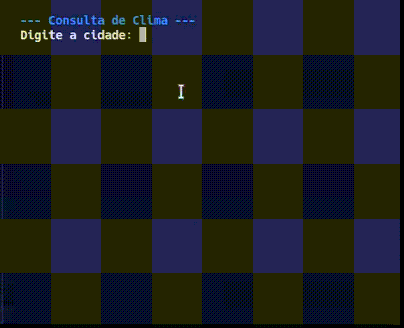

# Weather App Python

Este é um aplicativo de terminal desenvolvido em Python que consome a API do **OpenWeatherMap** para fornecer informações meteorológicas em tempo real.

---
## Descrição
O projeto consiste em um script Python que consome dados climáticos em tempo real. A interface foi construída utilizando a biblioteca `Rich` para formatação de texto e tabelas no terminal, mantendo o foco na legibilidade dos dados de saída.

---

## Características Técnicas
* **Integração de API:** Uso da biblioteca `requests` para chamadas REST.
* **Gerenciamento de Ambiente:** Utilização de `python-dotenv` para desassociar chaves de API do código-fonte.
* **Modularização:** Separação entre a lógica de requisição (`weather_service.py`) e a interface de usuário (`weather.py`).
---

## Requisitos e Instalação

1. ## Clonar o Repositório:
   Primeiro, clone este repositório para a sua máquina local:
   ```
   git clone https://github.com/markou66/weather-app-python.git
   
   cd weather-app-python

2. ## Dependências:
   Instale as bibliotecas necessárias através do arquivo de requisitos:
   ```bash
   pip install -r requirements.txt

3. ## Configuração da API:
   Renomeie o arquivo .env.example para .env e insira sua chave da API OpenWeather
   ```
   API_KEY=seu_token_aqui

4. ## Execução:
   ```
   python weather.py
---

## Demonstração: 

Aqui está o sistema em funcionamento no terminal:

